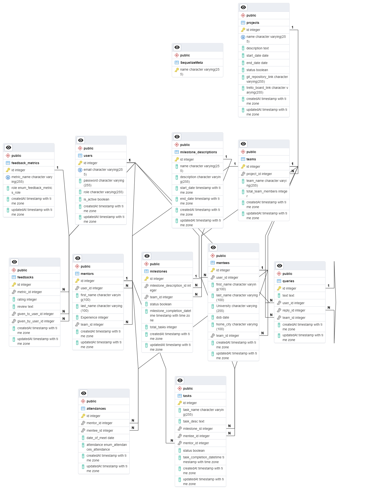

# Evolve Mentor Mentee Management Project

Install instructions:
```
git clone https://github.com/Evolve-Project/evolve-project-management-system
cd evolve-project-management-system
```
## For Frontend 
```
cd frontend 
npm install 
npm run dev
```
## For Backend

create a copy of .env.example file and remove the .example extension
PORT = 8000
SECRET = 'H5Vxuw0vOU'

CLIENT_URL = http://localhost:3000
SERVER_URL = http://localhost:8000 
DB_USERNAME=postgres
DB_PASSWORD=12345678
DB_NAME=evolve_application
DB_HOST=localhost
DB_DIALECT=postgres
DB_PORT=5432
```
cd backend
npm install
npm run dev
```

## For Database
So guys here is the basic details about our database so far

### Folder Structure
> **The main folders you need to be aware of are:**

**config:** This folder contains configuration for your database setup. It includes details like the database name, username, password, host, and dialect. So install and setup postgres on your machine and I don't think you will need to make changes to this file, I have kept everything default but if you still encounter any problems feel free to ping me

**models:** This folder contains files for each model in your application. Each file defines a database table and its fields. That means each file you see in models folder is a table in our database, you can check it out and see if everything adds up.


**migrations:** This folder contains migration files. Each file defines a change to the database schema, like creating a table or adding a column.
>-- don't worry too much about migrations folder for now

### Database Tables


### Migrations
We have added corresponding migrations for each table. To run the migrations, use the following command:

**NOTE: Make sure to run these commands in the /backend directory.** // not in backend/src directory
```javascript
npx sequelize-cli db:migrate
```
This command will run all pending migrations(create all the tables in your database automatically). Migrations are considered pending if they have not been run yet.


Please note that migrations should be run in the order they were created to ensure the integrity of your database schema.
and for that we can migrate each file individually also using:
```javascript
npx sequelize-cli db:migrate npx sequelize-cli db:migrate --name migration_file_name.js
```
But do not worry, I have set all the files in correct order, so you can just run the first command and it will create all the tables in your database.

To undo the last migration, you can use the following command:
```bash
npx sequelize-cli db:migrate:undo
```
This command will undo the last migration that was run. If you want to undo all migrations, you can use the following command:
```bash
npx sequelize-cli db:migrate:undo:all
```
This command will undo all migrations that have been run.

### Seeders
Seeders are scripts that populate your database with initial data. They're often used in development environments to provide a set of data that helps test the application. Seeders can also be used in production to insert necessary data into the database, such as admin users or default settings.

In Sequelize, seeders are JavaScript files that export an object with two methods: up and down. The up method is used to insert data into the database, and the down method is used to undo the changes made by the up method.

**Running Seeders:**
To run your seeders, you can run the following command:
```bash
npx sequelize-cli db:seed:all
```

This command will run all the seeders in your seeders directory, in the order they are listed.

To undo the seeders, you can run the following command:
```bash
npx sequelize-cli db:seed:undo:all
```
This command will undo all your seeders, in the reverse order they are listed.


# quick way to setup database and add dummy data
#### Open the terminal and navigate to /backend directory and run the following commands in the order they are listed(no need to go to /backend/src directory)
```bash
npx sequelize-cli db:drop
npx sequelize-cli db:create
npx sequelize-cli db:migrate
npx sequelize-cli db:seed:all
```
This will create the database, run all the migrations and seeders and add dummy data to the database.

## tables in evolve_application database in human readable format for reference

### SequelizeMeta

| Column | Type           | Comment | PK  | Nullable | Default |
|--------|----------------|---------|-----|----------|---------|
| name   | varchar(255)  |         | YES | NO       |         |

### attendances

| Column       | Type                   | Comment | PK  | Nullable | Default |
|--------------|------------------------|---------|-----|----------|---------|
| mentor_id    | integer                |         |     | NO       |         |
| mentee_id    | integer                |         |     | NO       |         |
| date_of_meet | date                   |         |     | NO       |         |
| attendance   | USER-DEFINED           |         |     | NO       |         |
| createdAt    | timestamp with time zone |       |     | NO       |         |
| updatedAt    | timestamp with time zone |       |     | NO       |         |

### feedback_metrics

| Column      | Type           | Comment | PK  | Nullable | Default |
|-------------|----------------|---------|-----|----------|---------|
| id          | integer        |         | YES | NO       |         |
| metric_name | varchar(255)   |         |     | NO       |         |
| role        | USER-DEFINED   |         |     | NO       |         |
| createdAt   | timestamp with time zone | |     | NO       |         |
| updatedAt   | timestamp with time zone | |     | NO       |         |

### feedbacks

| Column           | Type           | Comment | PK  | Nullable | Default |
|------------------|----------------|---------|-----|----------|---------|
| metric_id        | integer        |         |     | NO       |         |
| rating           | integer        |         | YES |          |         |
| review           | text           |         | YES |          |         |
| given_to_user_id | integer        |         | YES |          |         |
| given_by_user_id | integer        |         | YES |          |         |
| createdAt        | timestamp with time zone | |     | NO       |         |
| updatedAt        | timestamp with time zone | |     | NO       |         |

### mentees

| Column    | Type           | Comment | PK  | Nullable | Default |
|-----------|----------------|---------|-----|----------|---------|
| id        | integer        |         | YES | NO       |         |
| user_id   | integer        |         |     | NO       |         |
| first_name| varchar(100)   |         |     | NO       |         |
| last_name | varchar(100)   |         |     | YES      |         |
| University| varchar(255)   |         |     | NO       |         |
| dob       | date           |         |     | NO       |         |
| home_city | varchar(100)   |         |     | YES      |         |
| team_id   | integer        |         |     | YES      |         |
| createdAt | timestamp with time zone | |     | NO       |         |
| updatedAt | timestamp with time zone | |     | NO       |         |

### mentors

| Column    | Type           | Comment | PK  | Nullable | Default |
|-----------|----------------|---------|-----|----------|---------|
| id        | integer        |         | YES | NO       |         |
| user_id   | integer        |         |     | NO       |         |
| first_name| varchar(100)   |         |     | NO       |         |
| last_name | varchar(100)   |         |     | YES      |         |
| Experience| integer        |         |     | NO       |         |
| team_id   | integer        |         |     | NO       |         |
| createdAt | timestamp with time zone | |     | NO       |         |
| updatedAt | timestamp with time zone | |     | NO       |         |

### milestone_descriptions

| Column      | Type           | Comment | PK  | Nullable | Default |
|-------------|----------------|---------|-----|----------|---------|
| id          | integer        |         | YES | NO       |         |
| name        | varchar(255)   |         |     | NO       |         |
| description | varchar(255)   |         |     | NO       |         |
| start_date  | timestamp with time zone | |     | NO       |         |
| end_date    | timestamp with time zone | |     | NO       |         |
| createdAt   | timestamp with time zone | |     | NO       |         |
| updatedAt   | timestamp with time zone | |     | NO       |         |

### milestones

| Column                    | Type           | Comment | PK  | Nullable | Default |
|---------------------------|----------------|---------|-----|----------|---------|
| id                        | integer        |         | YES | NO       |         |
| milestone_description_id | integer        |         |     | NO       |         |
| team_id                   | integer        |         |     | NO       |         |
| status                    | boolean        |         |     | YES      | false   |
| milestone_completion_datetime | timestamp with time zone | | | YES |      |
| total_tasks               | integer        |         |     | YES      |         |
| createdAt                 | timestamp with time zone | |     | NO       |         |
| updatedAt                 | timestamp with time zone | |     | NO       |         |

### projects

| Column              | Type           | Comment | PK  | Nullable | Default |
|---------------------|----------------|---------|-----|----------|---------|
| id                  | integer        |         | YES | NO       |         |
| name                | varchar(255)   |         |     | NO       |         |
| description         | text           |         |     | NO       |         |
| start_date          | date           |         |     | NO       |         |
| end_date            | date           |         |     | NO       |         |
| status              | boolean        |         |     | YES      | false   |
| git_repository_link | varchar(255)   |         |     | NO       |         |
| trello_board_link   | varchar(255)   |         |     | NO       |         |
| createdAt           | timestamp with time zone | |     | NO       |         |
| updatedAt           | timestamp with time zone | |     | NO       |         |

### queries

| Column    | Type           | Comment | PK  | Nullable | Default |
|-----------|----------------|---------|-----|----------|---------|
| id        | integer        |         | YES | NO       |         |
| text      | text           |         |     | NO       |         |
| user_id   | integer        |         |     | NO       |         |
| reply_id  | integer        |         |     | YES      |         |
| team_id   | integer        |         |     | NO       |         |
| createdAt | timestamp with time zone | |     | NO       |         |
| updatedAt | timestamp with time zone | |     | NO       |         |

### tasks

| Column                   | Type           |

 Comment | PK  | Nullable | Default |
|--------------------------|----------------|---------|-----|----------|---------|
| id                       | integer        |         | YES | NO       |         |
| task_name                | varchar(255)   |         |     | NO       |         |
| task_desc                | text           |         |     | NO       |         |
| milestone_id             | integer        |         |     | NO       |         |
| mentee_id                | integer        |         |     | YES      |         |
| mentor_id                | integer        |         |     | YES      |         |
| status                   | boolean        |         |     | NO       | false   |
| task_completion_datetime | timestamp with time zone | | | YES      |         |
| createdAt                | timestamp with time zone | |     | NO       |         |
| updatedAt                | timestamp with time zone | |     | NO       |         |

### teams

| Column             | Type           | Comment | PK  | Nullable | Default |
|--------------------|----------------|---------|-----|----------|---------|
| id                 | integer        |         | YES | NO       |         |
| project_id         | integer        |         |     | YES      |         |
| team_name          | varchar(255)   |         |     | NO       |         |
| total_team_members | integer        |         |     | NO       |         |
| createdAt          | timestamp with time zone | |     | NO       |         |
| updatedAt          | timestamp with time zone | |     | NO       |         |

### users

| Column    | Type           | Comment | PK  | Nullable | Default         |
|-----------|----------------|---------|-----|----------|-----------------|
| id        | integer        |         | YES | NO       |                 |
| email     | varchar(255)   |         |     | NO       |                 |
| password  | varchar(255)   |         |     | NO       |                 |
| role      | varchar(255)   |         |     | NO       | 'user'::character varying |
| is_active | boolean        |         |     | YES      |                 |
| createdAt | timestamp with time zone | |     | NO       |                 |
| updatedAt | timestamp with time zone | |     | NO       |                 |

## ERD for evolve_application database
