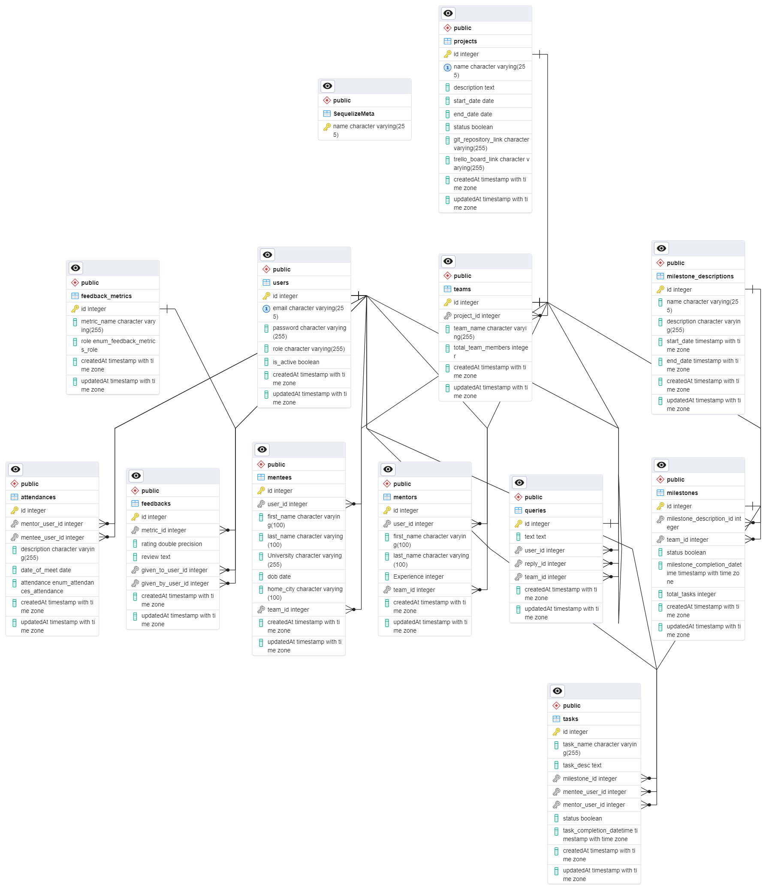

# Evolve Mentor Mentee Management System
Welcome to the Evolve Mentor Mentee Management System. This project is designed to facilitate the interaction between mentors and mentees in a structured manner. It provides a platform for mentors and mentees to track their progress, set goals, and communicate effectively. The application also includes a admin panel to manage users, projects, track progress of individual mentees and mentors, and gather feedback from users.

The project is divided into two main parts: the `frontend` and the `backend`. The frontend is built using React and Vite, providing a user-friendly interface for both mentors and mentees. The backend is a Node.js server that handles data management and business logic.

The system also integrates with a PostgreSQL database to store and manage data. The database structure includes tables for users, projects, milestones, and more. The database is managed using Sequelize, a popular ORM for Node.js.

To get started with the project, follow the installation instructions provided in this README. If you encounter any issues or have any suggestions, feel free to contribute or open an issue.

Happy coding!

# Project Structure
The project is structured as follows:
- `frontend/`: Contains all frontend code and related configuration files.
  - `src/`: Contains the source code for the Frontend.
    - `api/`: Contains asynchronous calls made to the server, facilitating communication between the frontend and backend systems.
    - `asserts/`: Here reside images and assets essential for the frontend user interface
    - `components/`: Basic components required for frontend pages.
    - `pages/`: Contains pages for different user roles, including administrators, mentors, and mentees.
    - `redux/`: Contains Redux store actions and reducers, responsible for managing application state and enabling seamless data flow between components. Redux facilitates centralized state management, ensuring consistency and predictability across the application.
    - `styles/`: Contains style sheets and styling configurations essential for shaping the frontend appearance and layout.
- `backend/`: Contains all backend code and related configuration files.
    - `src/`: Contains the source code for the backend.
      - `config/`: Contains configuration files for the database setup.
      - `controllers/`: Contains the controllers for handling HTTP requests.
      - `models/`: Contains Sequelize models for each table in the database.
      - `routes/`: Contains the routes for the API.
      - `services/`: Contains the business logic for the application.
      - `validators/`: Contains validation logic for incoming requests.
`README.md`: Contains the project documentation and setup instructions.

# Installation
To install and run the project, follow these steps:

1. Clone the repository:
git clone https://github.com/Evolve-Project/evolve-project-management-system
cd evolve-project-management-system

2. Create a PostgreSQL database and update the database configuration in the `backend/.env` file. Speaking of which, you will need to create a `.env` file in the `backend` directory and add the following environment variables:
```bash
PORT = <PORT_NUMBER>
SECRET = '<SECRET_KEY>'

CLIENT_URL =  '<CLIENT_URL>'
SERVER_URL =  '<SERVER_URL>'

DB_USERNAME=<DB_USERNAME>
DB_PASSWORD=<DB_PASSWORD>
DB_NAME=<DB_NAME>
DB_HOST=<DB_HOST>
DB_DIALECT=<DB_DIALECT>
DB_PORT=<DB_PORT>
```

3. Need Configuration for frontend in `frontend/.env`. Create a `.env` file in the `frontend` directory and add the following environment variables:
```bash
  VITE_SERVER_URL = '<SERVER_URL>'
```

4. Run the database migrations:
```bash
npx sequelize-cli db:migrate
```

5. Run the database seeders(optional):
```bash
npx sequelize-cli db:seed:all
```
Run the seeders only if you want to populate the database with some initial data. If you want to start with an empty database, you can skip this step.

6. Install and run the frontend:
```bash
cd frontend 
npm install (--legacy-peer-deps for wordcloud package installation)
npm run dev
```

7. Install and run the backend:
```bash
cd backend
npm install
npm run dev
```
Once the installation is complete, you can access the application by visiting the frontend URL in your browser.

# Usage
Once the installation is complete, you can access the application by visiting the frontend URL in your browser. The application provides a user-friendly interface for both mentors and mentees to track their progress, set goals, and communicate effectively. The admin panel allows you to manage users, projects, track progress of individual mentees and mentors, and gather feedback from users. Here are some of the main features of the application:

1. **User Authentication:** The application provides features for users to sign up, log in, and reset their passwords. User information is securely stored in the database. For enhanced security, the application utilizes JWT tokens for authentication. Additionally, all passwords are hashed using `bcrypt` to ensure data integrity and confidentiality.
   
2. **Mentor-Mentee Interaction:** Mentors and mentees can communicate(through Queries section) for any queries or doubts.
   
3. **Admin Panel:** Admins can manage users, projects, track progress of individual mentees and mentors, and gather feedback from users.
4. User Creation: Admins can create new users and assign them roles (mentor or mentee) as needed. Admin also has the ability to add bulk users using a CSV or Excel file. The admin is able to assign mentors to mentees and vice versa with a single click.
5. **Project Management:** The mentors have the freedom to create projects and assign them to mentees. They can also track the progress of the projects and provide feedback to the mentees. The mentees can view the projects assigned to them and track their progress. All this information is stored in the database and can be accessed through the admin panel.
6. **Feedback:** The application provides a feedback mechanism for users to provide feedback on their mentors, mentees, and projects. This feedback is stored in the database and can be accessed through the admin panel. The feedback is used to improve the mentor-mentee relationship and the overall user experience. The admin panel also includes a wordcloud of the feedback provided by the users. This wordcloud is generated using the `d3-cloud` library and provides a visual representation of the most common words used in the feedback. This helps the admin to quickly identify the most common themes and issues raised by the users.
7. **Attendance:** The application provides a feature for mentors to mark the attendance of the mentees. This information is stored in the database and can be accessed through the admin panel. The admin panel also includes a visual representation of the attendance data in the form of a bar chart. This helps the admin to quickly identify the attendance patterns of the mentees and mentors.
8. **Milestones:** The application provides a feature for mentors to set milestones for the mentees. This information is stored in the database and can be accessed through the admin panel. The admin panel also includes a visual representation of the milestone data in the form of a line chart. This helps the admin to quickly identify the progress of the mentees and mentors towards their goals.
9. **User Profile:** The application provides a feature for users to view and update their profiles. Users can update their personal information, change their passwords.

## Here's a demo of the application:
[video of the application](video link)

# Components and APIs:
## Frontend:
The frontend is built using `React` and `Vite`. It provides a user-friendly interface for both mentors and mentees as well as the admin. 
### Third-party Libraries:
#### General Libraries Used:
- `axios`: Used for making HTTP requests to the backend API.
- `redux-toolkit`: Used for state management and data flow between components.
- `yarn`: Package manager for the frontend application.

#### Styling Libraries Utilized:
- `Style sheets`: Customized style sheets for consistent visual presentation.
- `Styled Components`: Dynamic styling using CSS-in-JS for enhanced component styling.
- `Tailwind CSS`:  Utility-first CSS framework for rapid UI development.

#### Icon Libraries Employed:
- `Material-UI Icons`: Icon set provided by the Material-UI library for intuitive and consistent visual cues.
- `Font Awesome Icons`: Versatile icon set from Font Awesome library for a wide range of icons.
- `Bootstrap Icons`: Icon library from Bootstrap framework offering a collection of scalable icons.

#### UI Component Libraries Integrated:
- `Material-UI:`: Comprehensive UI component library offering pre-designed and customizable components for React applications.
- `Shadcn-UI`: UI component library providing modern and responsive components for building user interfaces.
- `Radix-UI`: Toolkit for building component libraries and design systems with React.
- `Chakra-UI`: A simple, modular, and accessible component library that provides building blocks for React applications.

#### Notification Libraries:
- `SweetAlert2`: A beautiful, responsive, customizable, accessible, and replacement for JavaScript's popup boxes.


### State Management:
- Redux: A predictable state container for JavaScript apps.
- React-Redux: Official React bindings for Redux.
- Redux-Thunk: Middleware that allows you to write action creators that return a function instead of an action.

### Components:
- `App`: The main component that renders the entire application. It includes the routing logic and renders the appropriate components based on the URL.
- `Home`: The home page component that is displayed when the user is not logged in. It includes a brief description of the application and a call-to-action to sign up or log in.
- `Dashboard`: The dashboard component that is displayed when the user is logged in. It includes the main content of the application, such as the user profile, projects, feedback, and attendance.
  - `Project and User Details`: Admin have Comprehensive view of all project details and users within the system. Ability to filter users based on their roles for streamlined management.
  - `Personal Information`: Mentor and Mentee can view their personal details and edit if necessary.
  - `Team Members and Projects Information`: Information about team members and assigned projects, Capability for mentors to create new projects if none are assigned.
- `Sidebar`: The sidebar provides quick access to essential features based on the user's role, ensuring efficient navigation and usability within the application.
  Here are the routes as per the users:
    1. Admin Routes:
      - `Dashboard`: Overview of projects and their mentors. Includes Mentor and Mentee satisfaction level of that particular project and average of attendance and progress of the project. Contains information of total number of mentors and mentees and projects assigned.
      - `User Management`: Information about all users and add individual User or bulk user
      - `Attendance`: Monitor and manage attendance records of users or teams.
      - `Projects`: View project details and progress of the project and verify it will github and trello application.
      - `Satisfaction`: Monitor user satisfaction metrics, feedback, and ratings.

    2. Mentor Routes:
      - `Dashboard`: Overview of mentor-specific information, project and team members info.
      - `Attendance`: Record and track attendance for assigned mentees.
      - `Feedback`: Provide feedback and evaluations for assigned mentees.
      - `Query`: Address queries, concerns, or requests raised by team members.

    3. Mentee Routes:
      - `Dashboard`: Overview of mentee-specific information, project and team members info.
      - `Attendance`: View attendance records and history.
      - `Feedback`: Provide feedback and evaluations for assigned mentors.
      - `Query`: Raise queries, concerns, or requests raised by team members.

    4. Common Routes:
    - `Sign Out`: Available across all user roles to log out and securely end the session.

- `Add Users`:
1. **Single User Addition:** Use forms to add individual mentors or mentees.
2. **Bulk Upload:** Utilize drag-and-drop functionality to upload multiple users at once via Excel sheets using the `react-dropzone` package.
    ```bash
    npm install react-dropzone
    ```


- `Attendance` : 
  1. **Admin view:** Admin can retrieve attendance data for all mentees and Filter attendance records by project name and date range for better organization and analysis.
  2. **Mentor view:** Capability for mentors to record and edit attendance data.
  3. **Mentee view:** Display attendance records for mentees as per attendance history.

- `Satisfaction`: The satisfaction component offers various views for feedback analysis, including visual representations, detailed reports, and word clouds, providing comprehensive insights into user sentiment.
    - `Word Cloud`: The [`react-wordcloud`](https://www.npmjs.com/package/react-wordcloud) package offers an insightful overview of prominent keywords highlighted in feedback reviews provided by both mentors and mentees within a specific project context.
      ```bash
      npm install react-wordcloud
      ```
      - Note that react-wordcloud requires react^16.13. 0 as a peer dependency.
    - `Visual representation`: The [`react-chartjs-2`](https://www.npmjs.com/package/react-chartjs-2) package offers robust charting capabilities, enabling the creation of meaningful visual representations. In this context, a bar chart is utilized to showcase ratings assigned by team members to an individual team member, providing valuable insights at a glance.
      ```bash
      npm install react-chartjs-2
      ```
    - `Edit metrics`: Admin have access for adding, editing, deleting metrics.
- `Milestones` :
  1. `Mentor view`
       - `Task Creation `: Ability for mentors to create tasks.
       - `Assign Tasks`: Mentors can assign tasks to mentees and track their progress.
       - `Task Status Updates`: Mentors can update the status of tasks as they are completed.
  2. `Mentee view`
       - `View Tasks`: Mentees can view tasks assigned to them by mentors.
       - `Task Progress`: Track the progress of tasks assigned by mentors.
- `Feedback` : 
  1. `Mentor view`
       - `Provide Feedback`: Mentors can share feedback about mentees.
       - `Rating Metrics`: Ability to rate mentees based on predefined metrics.
       - `Commenting`: Mentors can provide comments along with the ratings.
  2. `Mentee view`
       - `Share Feedback`: Mentees can share feedback about mentors.
       - `Rating Metrics`: Ability to rate mentors based on predefined metrics.
       - `Commenting`: Mentees can provide comments along with the ratings.
- `Query System` :
    - `Ask Queries`: Users can post queries or questions.
    - `Team Response`: Queries are answered by any member of the team.
    - `Collaborative Support`: Encourages teamwork and collaboration in resolving queries.

## Backend:
The backend is a Node.js server that handles data management and business logic. It integrates with a PostgreSQL database to store and manage data. The database structure includes tables for users, projects, milestones, and more. The database is managed using Sequelize, a popular ORM for Node.js.
### Third-party Libraries:
#### Server Setup and HTTP Handling:
- **express**: Used for creating the server and handling HTTP requests.

#### Database Management:
- **sequelize**: Used for managing the database and defining models.
- **pg**: PostgreSQL client for Node.js.
- **pg-hstore**: A package for serializing and deserializing JSON data to hstore format.

#### Authentication and Security:
- **jsonwebtoken**: Used for generating and verifying JWT tokens for user authentication.
- **bcrypt**: Used for hashing passwords for enhanced security.
- **passport**: Express-compatible authentication middleware for Node.js.
- **passport-jwt**: Passport strategy for authenticating with a JSON Web Token.
- **Nodemailer**: Module for Node.js applications to allow easy email sending.

#### Request and Response Handling:
- **body-parser**: Middleware to handle parsing of request body.
- **cookie-parser**: Middleware to parse cookie header and populate req.cookies.
- **cors**: Middleware to enable CORS (Cross-Origin Resource Sharing).

#### Development:
- **nodemon**: Utility that monitors for any changes in your source and automatically restarts your server.

#### File Handling:
- **multer**: Middleware for handling multipart/form-data, primarily used for uploading files.
- **faker**: Generates massive amounts of fake data in Node.js and the browser.


#### Other:
- **dotenv**: Loads environment variables from a .env file into process.env.
- **canvas**: A Cairo backed Canvas implementation for Node.js.
- **d3-cloud**: Word cloud layout by Jason Davies.
- **stopword**: A module for removing stop words.
- **xlsx**: Parser and writer for various spreadsheet formats.


### APIs:
- `POST /api/auth/signup`: Used for user registration. It accepts the user's email, password, and role, and creates a new user in the database.

Determining workspace structure

Deciding which workspace information to collect

Gathering workspace info

## Database

The database is a PostgreSQL database that stores and manages data for the application. It includes tables for users, projects, milestones, and more. The database is managed using Sequelize, a popular ORM for Node.js.

### Tables

- `users`: Contains information about the users of the application.
  - Columns: `id`, `email`, `password`, `role`
  - Constraints: `id` is the primary key, `email` is unique
  - Relationships: Has one `Mentee` or one `Mentor`, has many `Query`, has many `Feedback` (given to them), has many `Feedback` (given by them)

- `mentors`: Contains information about the mentors.
  - Columns: `user_id`, `first_name`, `last_name`, `Experience`, `team_id`
  - Constraints: `user_id` is unique and references `users.id`, `team_id` references `teams.id`
  - Relationships: Belongs to `User`, belongs to `Team`

- `mentees`: Contains information about the mentees.
  - Columns: `user_id`, `first_name`, `last_name`, `University`, `dob`, `home_city`, `team_id`
  - Constraints: `user_id` is unique and references `users.id`, `team_id` references `teams.id`
  - Relationships: Belongs to `User`, belongs to `Team`

- `projects`: Contains information about the projects.
  - Columns: `id`, `name`, `description`, `start_date`, `end_date`, `status`, `links`
  - Constraints: `id` is the primary key
  - Relationships: Has many `Milestone` through `Team`

- `milestones`: Contains information about the milestones associated with each project.
  - Columns: `id`, `title`, `description`, `due_date`, `status`, `project_id`
  - Constraints: `id` is the primary key, `project_id` references `projects.id`
  - Relationships: Belongs to `Project`, has many `Task`

- `tasks`: Contains information about the tasks associated with each milestone.
  - Columns: `id`, `title`, `description`, `due_date`, `status`, `milestone_id`
  - Constraints: `id` is the primary key, `milestone_id` references `milestones.id`
  - Relationships: Belongs to `Milestone`

- `queries`: Contains information about the queries raised by mentees and the responses from mentors.
  - Columns: `id`, `text`,`user_id`, `reply_id`, `team_id`
  - Constraints: `id` is the primary key, `user_id` references `users.id`, `reply_id` references `queries.id`, `team_id` references `teams.id`.
  - Relationships: Belongs to `User`, belongs to `Query` (for replies), belongs to `Team`.
- `teams`: Contains information about the teams in the system.
  
- `teams`: Contains information about the teams in the system.
  - Columns: `id`, `name`, `project_id`
  - Constraints: `id` is the primary key, `project_id` references `projects.id`
  - Relationships: Has many `Mentor`, has many `Mentee`, belongs to `Project`

- `feedbacks`: Contains feedback provided by mentors for their mentees.
  - Columns: `id`, `feedback_text`, `given_to_user_id`, `given_by_user_id`
  - Constraints: `id` is the primary key, `given_to_user_id` references `users.id`, `given_by_user_id` references `users.id`
  - Relationships: Belongs to `User` (given to), belongs to `User` (given by)

Each table is defined in its respective model file in the `backend/src/models/` directory.

### Migrations

Migrations are used to define changes to the database schema. They are located in the `backend/src/migrations/`directory. To run the migrations, use the following command:

```sh
npx sequelize-cli db:migrate
```

### Seeders

Seeders are used to populate the database with initial data. They are located in the `backend/src/seeders/` directory. To run the seeders, use the following command:

```sh
npx sequelize-cli db:seed:all
```

### Configurations

Database configurations are located in the `backend/src/config/` directory. It includes details like the database name, username, password, host, and dialect. We are using `.env `file to store the environment variables. And the configuration is loaded from the `.env` file.

### Entity Relationship Diagram


***Thank you for reading the README. We hope you enjoy using the Evolve Mentor Mentee Management System! If you encounter any issues or have any suggestions, feel free to contribute or open an issue. Happy coding!***